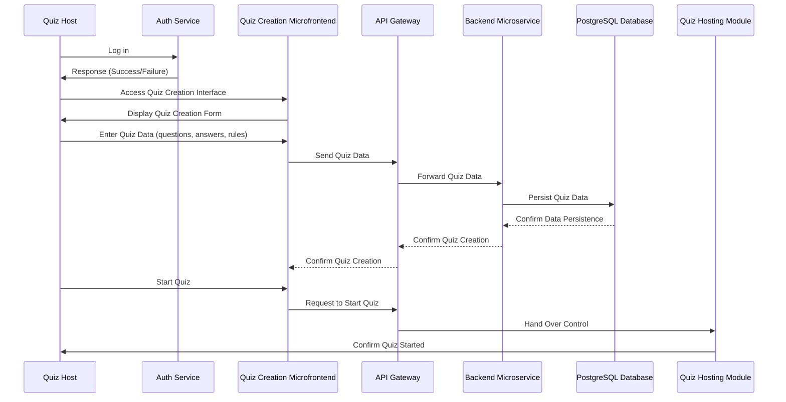
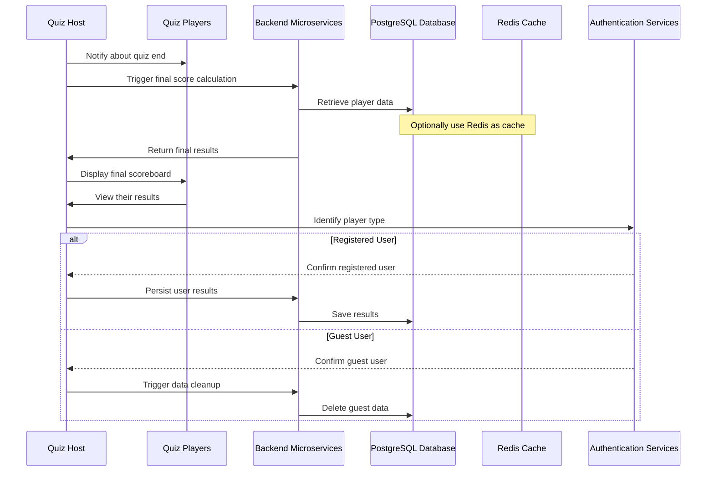

# Scenario 1: Quiz Creation and Start

## Description
The quiz host logs in, creates a new quiz, and starts the session.

## Content Aspects

### Actors and Roles
- **Quiz Host:** The person who initiates the quiz session.
- **Supporting Components:** e.g., the authentication service.

### Interactions
- Login and authentication (e.g., via Auth0).
- Entering quiz data (questions, answers, rules) in the frontend (microfrontend for quiz creation).
- Validation and persistence of the quiz data in the database.
- Handing over control to the quiz hosting module to initiate the quiz start.

### Involved Building Blocks
- **Frontend:** Quiz creation microfrontend.
- **Backend Microservice:** Responsible for quiz management.
- **API Gateway:** Along with authentication/authorization components.
- **Database:** PostgreSQL.

# Scenario 2: Quiz Participation and Real-Time Communication

## Description
Players join the ongoing quiz, and once the host starts the quiz, questions are synchronized in real-time.

## Content Aspects

### Actors and Roles
- **Quiz Host:** Responsible for starting and controlling the session.
- **Quiz Players:** Participants joining via a code or link.

### Interactions
- Players joining the waiting room.
- Establishment of a real-time connection via WebSockets.
- The host starts the quiz, sending questions simultaneously to all players.
- Players send their answers back, which are processed in real-time to update results (e.g., displaying a live scoreboard).

### Involved Building Blocks
- **Frontend:** Microfrontends for both players and host.
- **WebSocket Server:** Responsible for bidirectional communication.
- **API Gateway.**
- **Optional:** Message broker (to scale WebSocket communication).

# Scenario 3: Quiz End, Results Display, and Data Persistence

## Description
After the quiz ends, the final results are displayed, quiz data for registered users is saved, and guest accounts are cleaned up.

## Content Aspects

### Actors and Roles
- **Quiz Host:** Ends the quiz and presents the final scoreboard.
- **Quiz Players:** View their results.

### Interactions
- The host ends the quiz session.
- Final calculation and display of the end results (scoreboard).
- Persistence of quiz results in the database (only for registered users).
- Automatic deletion of guest account data in accordance with privacy regulations.

### Involved Building Blocks
- **Backend Microservices:** For result calculation and data management.
- **Database:** PostgreSQL, optionally supplemented by Redis as a cache.
- **Authentication Services:** To distinguish between registered and guest users.

